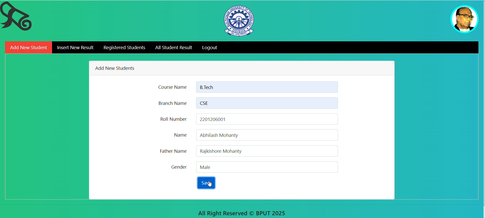
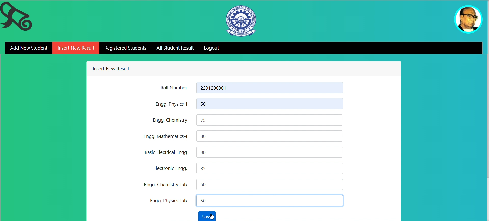
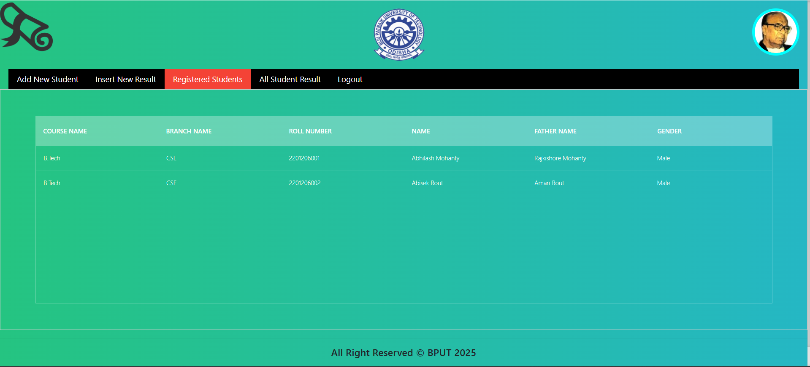
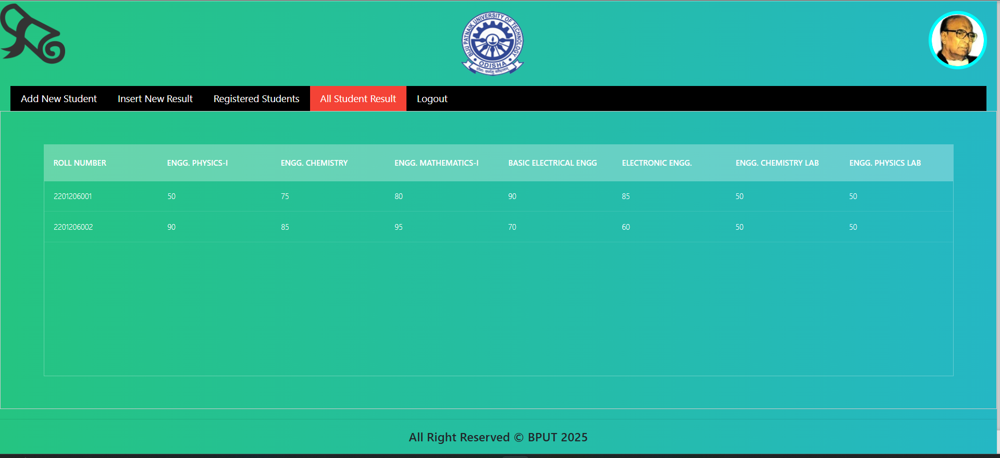
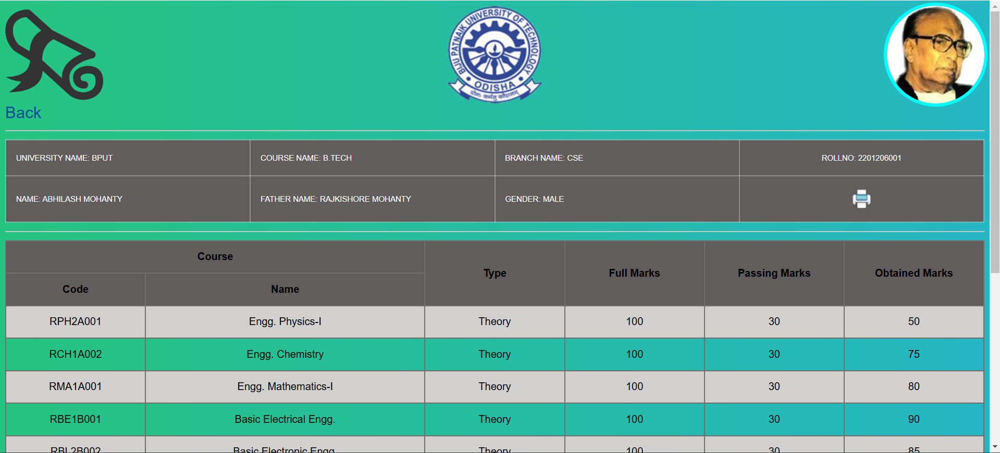
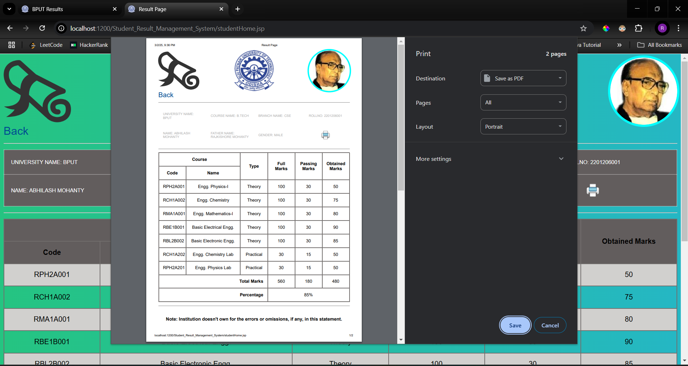
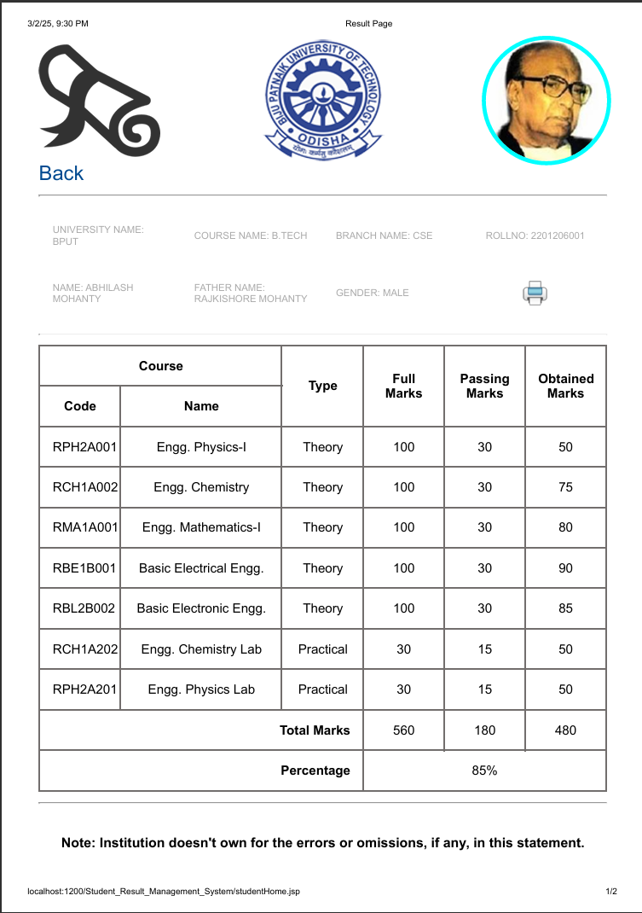

# 🎓 BPUT Result Management System  

A **JSP & Servlet-based** web application designed for **BPUT University students** to **check, manage, and download their results** efficiently. This system enables **administrators** to handle student records while providing a secure **student portal** for result access.  

---

## 🚀 Features  

### ✅ **Admin Panel**  
✔️ Secure **Admin Login**  
✔️ **Add New Student**  
✔️ **Insert New Result**  
✔️ **View Registered Students**  
✔️ **View All Students' Results**  

### ✅ **Student Portal**  
✔️ **Check Individual Results**  
✔️ **Download Result PDFs (BPUT Format)**  

---

## 🛠️ Tech Stack  

🔹 **Frontend:** HTML, CSS, JavaScript   
🔹 **Backend:** Java (JSP & Servlets)  
🔹 **Database:** MySQL  
🔹 **Server:** Apache Tomcat  
🔹 **Tools:** Eclipse IDE

---

## 📸 Screenshots  

### 🎯 **Homepage**  
  

### 📝 **Add New Student Page**  
  

### 📊 **Insert New Result Page**  
  

### 📋 **View Registered Students**  
  

### 📑 **All Students Result Page**  
  

### 📑 **Student Result Page**  
  

### 🏆 **Student Result PDF Download (BPUT)**  
  

  


---

## ⚡ Setup & Installation  

1️⃣ Clone the repository:  
```sh
git clone https://github.com/yourusername/BPUT-Result-Management.git
```  
2️⃣ Import the project into **Eclipse/IntelliJ IDEA**.  
3️⃣ Configure **MySQL Database** (Import `database.sql`).  
4️⃣ Update **Database Credentials** in `dbConfig.java`.  
5️⃣ Deploy on **Apache Tomcat**.  
6️⃣ Access via `http://localhost:8080/BPUT-Result-Management/`.  

---


## 📜 License  

This project is licensed under the **MIT License** – see the [LICENSE](./LICENSE) file for details.  

---

## 🤝 Contributing  
Got ideas? Open an **issue** or create a **pull request**!  

**🔗 Connect with me:** [LinkedIn](https://www.linkedin.com/in/rakesh-kumar-parida-523b55308/) 

⭐ **If you found this useful, don't forget to star the repo!** 🚀  
